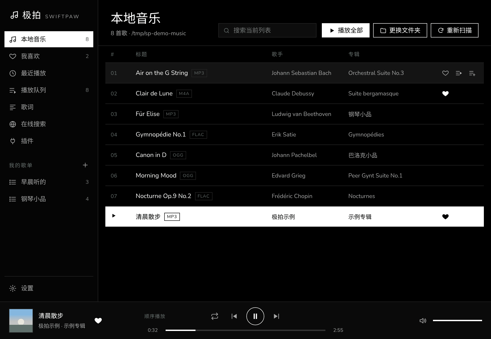
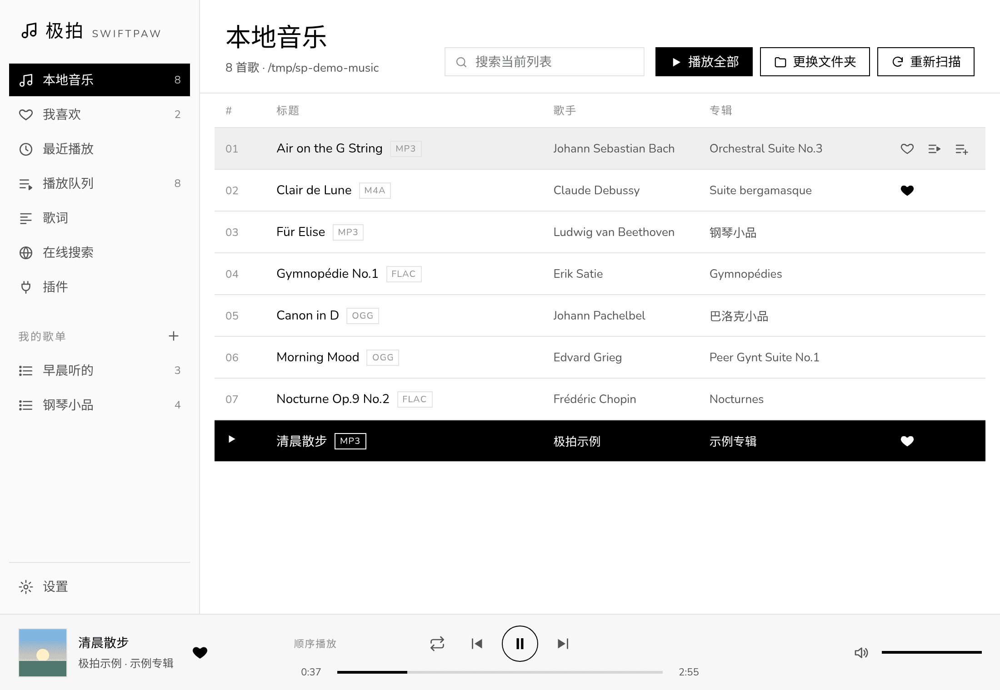
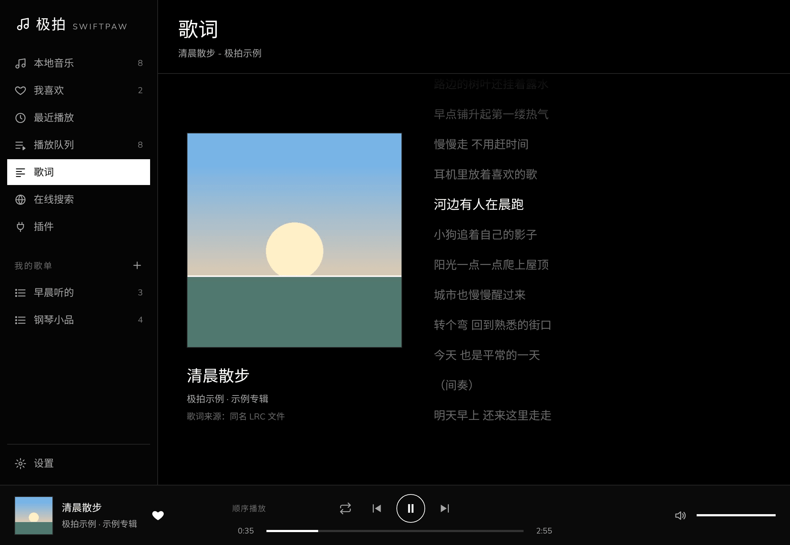
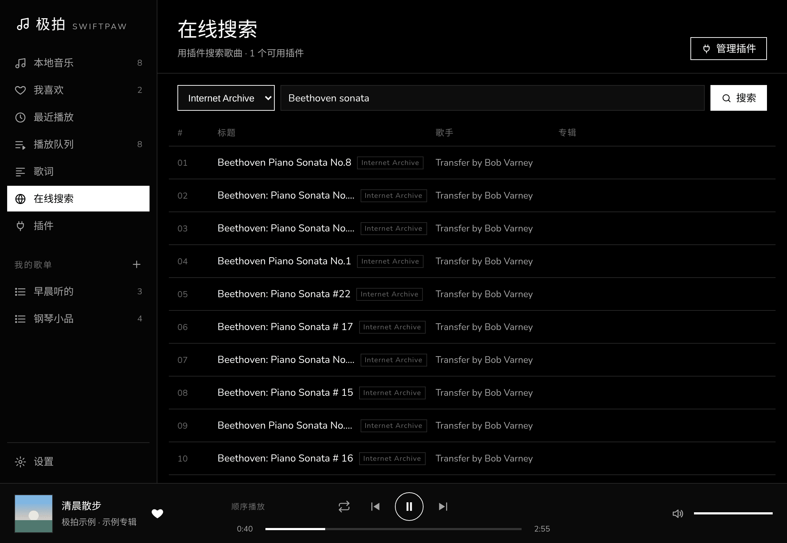
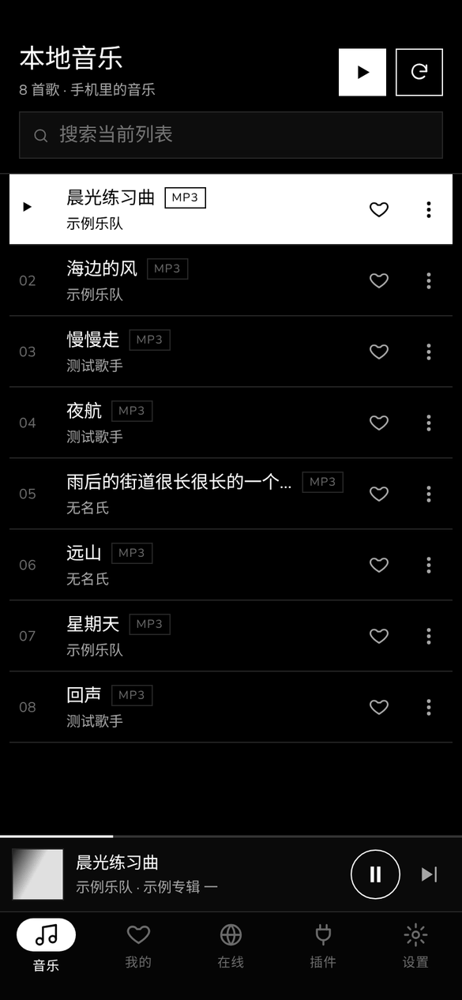
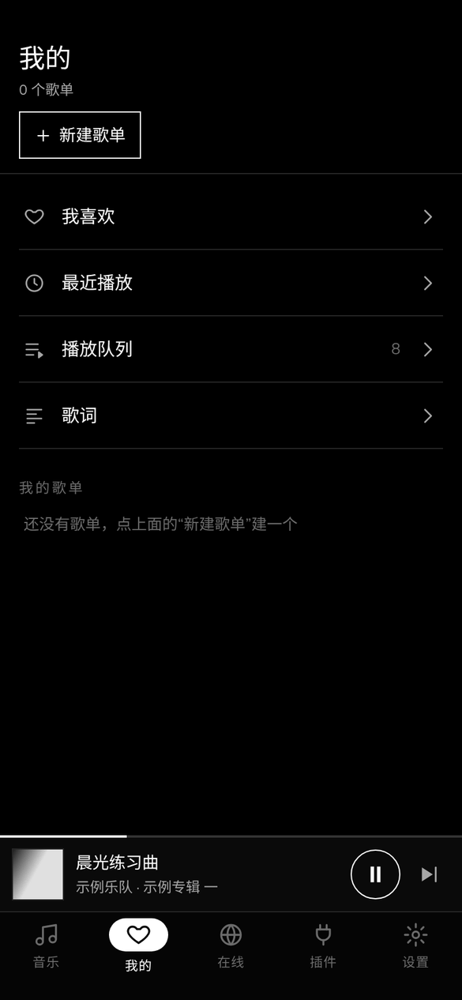
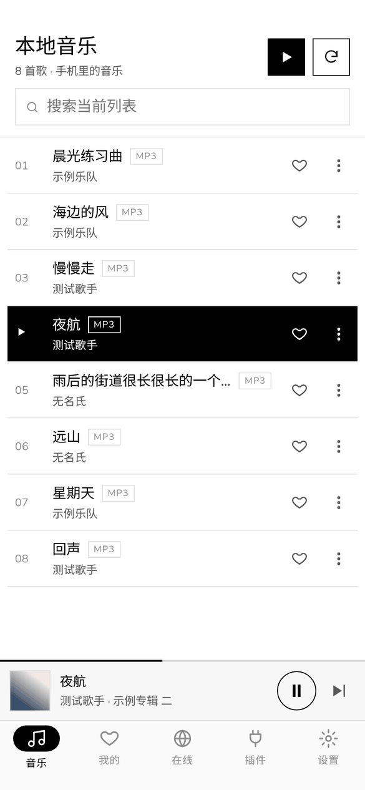

# 极拍 SwiftPaw

**简体中文** | [English](README.en.md)

[](https://github.com/dongzhongcen/SwiftPaw/actions/workflows/test.yml)
[](https://github.com/dongzhongcen/SwiftPaw/actions/workflows/build-windows.yml)
[](https://github.com/dongzhongcen/SwiftPaw/actions/workflows/build-android.yml)
[](https://github.com/dongzhongcen/SwiftPaw/releases)


[](LICENSE)



## 简介

极拍（SwiftPaw）是我用 Go 和 [Wails](https://wails.io) 写的一个 Windows 桌面音乐播放器，现在也有 Android 版（Beta）。

我想做的播放器很简单：打开就能听本地的歌，界面干净，不需要登录。所以它的界面是黑白极简风格，所有数据（歌单、收藏、播放记录）都只存在自己电脑上。

后来我又给它加了插件系统：插件是一个小小的 JS 文件，告诉播放器去哪里搜歌、怎么拿到播放地址。这样播放器本身不绑定任何音乐平台，想听什么由插件决定。仓库里带了一个示例插件，可以搜索 Internet Archive 上的公有领域音乐。

Android 版用 [Capacitor](https://capacitorjs.com) 打包，界面和桌面版是同一套前端（窗口窄的时候自动换成手机布局），播放队列、歌单、歌词、插件这些功能也是同一份 Go 代码，用 gomobile 编译给 Android 用。

代码里的注释我都尽量写得适合初学者看，每个文件也尽量保持短小。

## 功能特性

**本地音乐**
- 选择一个文件夹，自动扫描里面（包括子文件夹）的 MP3、FLAC、M4A、AAC、OGG、Opus、WAV
- 读取歌曲标签里的标题、歌手、专辑和内嵌封面
- 按标题、歌手、专辑、文件名搜索当前列表

**播放**
- 播放队列：下一首播放、从队列移除；顺序、单曲循环、随机三种模式（随机模式一轮内不重复）
- 某首歌放不了时自动跳到下一首，整个队列都放不了时停下来
- 支持键盘上的媒体键，Windows 的系统媒体浮窗里也能看到歌名和封面、控制播放
- 记住音量、播放模式、上次播放的歌和窗口大小

**歌单和歌词**
- 我喜欢、自建歌单、最近播放，保存在本地的 SQLite 数据库
- LRC 歌词：同名 `.lrc` 文件或音频文件内嵌的歌词，自动识别 UTF-8 / GBK 编码；当前行高亮，点一行就跳到那里

**插件和在线音乐**
- 从文件或网址安装插件，可以启用、停用、卸载
- 用插件在线搜索，搜到的歌可以直接播放、收藏、加入歌单
- 插件可以有自己的设置（比如 API Key），在插件页点“设置”填写，保存后马上生效
- 插件在内置的 JS 引擎（[goja](https://github.com/dop251/goja)）里运行，不需要装 Node.js；常用的 `axios`、`crypto-js`、`cheerio`、`dayjs` 等模块已经内置

**外观**
- 深色 / 浅色 / 跟随系统三种配色
- 三种风格，在设置页里点一下马上换：**唱片行**（暖色木纹，歌词页的封面是一张会转的黑胶唱片）、**节拍器**（明亮的浅色，进度条是一排节拍刻度）、**霓虹**（夜色和磨砂玻璃，唱到的歌词像灯管一样亮起来）。每种风格带一款开源中文字体（SIL OFL 许可证），只有选了这个风格才会加载
- 自定义背景图片：支持 JPG / PNG / WebP / GIF（最大 20 MB），可以调模糊和遮罩，搭配任何配色和风格都能用；图片会复制一份到软件自己的数据文件夹，原图删了也不影响
- “减少模糊效果”开关：关掉磨砂玻璃这类效果，老电脑和手机上更流畅（Android 上默认打开）

**Android 版（Beta）**

> Android 版目前是 Beta，还在开发中，以后会换一种编程语言重写；桌面版不受影响。

- 要求 Android 8.0 或更新，手机和平板都能用：竖屏是底部标签栏，平板和横屏是左边的标签栏
- “扫描本机音乐”读出手机里所有的音乐，不用选文件夹
- 后台播放：切到别的应用、锁屏后继续放；通知栏和锁屏上可以暂停、切歌、拖进度，耳机和蓝牙按键也能用
- 来电话或者别的应用放声音时自动暂停，拔耳机时暂停
- 迷你播放条点开是全屏的播放页，往下滑收起；返回键按层级返回，不会一下子退出
- 插件、在线搜索、歌单、收藏和桌面版一样（两边的数据是分开保存的）

## 界面截图

截图里本地音乐的歌都是我自己生成的测试音频，歌词也是我随手写的；在线搜索用的是仓库里的示例插件。

| 浅色主题 | 歌词 | 在线搜索 |
| :---: | :---: | :---: |
|  |  |  |

Android 版（Beta）：

| 本地音乐 | 播放页 | 我的 | 浅色主题 |
| :---: | :---: | :---: | :---: |
|  |  |  |  |

## 项目结构

```
SwiftPaw/
├── main.go               # 程序入口：创建窗口、绑定 App
├── app.go                # App：扫描文件夹、播放队列
├── app_store.go          # 歌单、收藏、最近播放
├── app_config.go         # 配置（config.json）
├── app_lyrics.go         # 歌词
├── app_plugins.go        # 插件、在线搜索、在线播放
├── window.go             # 记住窗口大小
├── version.go            # 版本号
├── handler.go            # /music、/cover、/stream 三个本地地址
├── internal/
│   ├── core/             # 桌面版和 Android 版共用的功能（App 和 Android 插件都转发到这里）
│   ├── music/            # 歌曲信息、扫描文件夹
│   ├── queue/            # 播放队列和播放模式
│   ├── store/            # SQLite：歌单、收藏、最近播放
│   ├── lyrics/           # LRC 解析、编码识别、找歌词
│   ├── jsrt/             # 插件的 JS 运行环境（goja + 内置模块）
│   ├── plugin/           # 插件的安装、加载和调用
│   ├── stream/           # 在线歌曲的播放代理
│   └── winstate/         # 窗口大小的保存和读取
├── frontend/             # 前端（原生 JS + Vite，没有用框架）
│   ├── src/js/           # 每个功能一个小模块：播放器、列表、歌词、插件页……
│   ├── src/css/          # 样式，颜色都在 theme.css 里，风格主题在 themes/
│   └── wailsjs/          # Go 方法的 JS 绑定（自动生成）
├── examples/plugins/     # 示例插件
├── scripts/
│   ├── genbindings/      # 不装 Wails 也能生成前端绑定
│   ├── notices/          # 生成第三方许可证说明 THIRD_PARTY_NOTICES.md
│   └── jslib/            # 把插件用的 JS 库打包成一个文件
├── mobile/               # Android 版：Go 内核接口、Capacitor 工程、编译脚本（见 mobile/README.md）
├── build/                # 图标、Windows 安装程序的配置
└── .github/workflows/    # 测试、Windows 和 Android 打包
```

## 快速开始

### 直接下载

到 [Releases](https://github.com/dongzhongcen/SwiftPaw/releases) 下载：

- `SwiftPaw-x.y.z-win-x64-setup.exe`：安装版
- `SwiftPaw-x.y.z-win-x64.zip`：免安装版，解压后运行 `SwiftPaw.exe`

还没有发布的最新代码，可以在 [Actions → 构建 Windows 版](https://github.com/dongzhongcen/SwiftPaw/actions/workflows/build-windows.yml) 里下载 `SwiftPaw-win-x64` 构建产物。

需要 Windows 10 / 11（64 位）和 WebView2（Windows 11 自带，Windows 10 大多也装好了）。

Android 版（Beta）下载 `SwiftPaw-x.y.z-android.apk`，需要 Android 8.0 或更新。没有上架应用商店，直接在手机上打开 APK 安装：
第一次安装时系统会问是否允许“安装未知应用”，在弹出的设置里允许当前用来打开 APK 的应用（比如浏览器或文件管理器）就行。
以后升级直接装新版本的 APK，歌单、收藏和插件都会保留。还没有发布的最新代码，可以在 [Actions → 构建 Android 版](https://github.com/dongzhongcen/SwiftPaw/actions/workflows/build-android.yml) 里下载 `SwiftPaw-android` 构建产物。

安装程序和 `SwiftPaw.exe` 目前没有代码签名，第一次运行时 Windows 可能会弹出「Windows 已保护你的电脑」。点「更多信息」，再点「仍要运行」就可以了，这不是病毒。

升级时直接运行新版本的安装程序就行：它会先检查有没有装过旧版本，问你是否替换，然后自动卸载旧版本、装到原来的文件夹。如果极拍正在运行，会提示先关掉。歌单、收藏、插件和插件设置都保存在 `%AppData%\SwiftPaw`，升级不会丢。

压缩包和安装文件夹里都带着 `LICENSE`、`THIRD_PARTY_NOTICES.md`（第三方开源软件的许可证）和 `OFL.txt`（字体许可证）。

### 第一次使用

1. 点“选择文件夹”，选你放音乐的文件夹
2. 点一首歌开始播放；点歌曲后面的红心收藏，或者加入歌单
3. 想在线搜歌：打开“插件”页 → “从文件安装”，选择 [`examples/plugins/archive-org.js`](examples/plugins/archive-org.js)，然后到“在线搜索”页搜索

Android 版第一次打开时点“扫描本机音乐”，允许极拍访问“音乐和音频”。手机里新放进去的歌，点“重新扫描”就能看到。
在手机上装插件可以用“从网址安装”，粘贴插件的地址（比如示例插件在 GitHub 上的 raw 地址）；也可以把 `.js` 文件存到手机里再“从文件安装”。

### 使用 Jamendo 插件

[`examples/plugins/jamendo.js`](examples/plugins/jamendo.js) 通过 Jamendo 官方 API 搜索和播放 Jamendo 上的音乐，支持搜索歌曲、选择音质播放和歌词（有歌词的歌曲才有）。需要你自己申请一个 Client ID：

1. 到 [devportal.jamendo.com](https://devportal.jamendo.com) 注册并登录，创建一个应用（app）
2. 复制这个应用的 Client ID
3. 打开“插件”页 → “从文件安装”，选择 `examples/plugins/jamendo.js`；也可以“从网址安装”，粘贴 `https://raw.githubusercontent.com/dongzhongcen/SwiftPaw/main/examples/plugins/jamendo.js`
4. 点 Jamendo 插件的「设置」，把 Client ID 粘贴到「Client ID」里保存，然后到“在线搜索”页搜索

没填 Client ID 或者填错时，插件会提示你到「设置」里检查。Jamendo 上的音乐由音乐人以知识共享（Creative Commons）许可证发布，每首歌的许可证可能不同；使用时请遵守 [Jamendo 的 API 使用条款](https://devportal.jamendo.com/api_terms_of_use)和对应的许可证。无损音质只在音乐人允许下载的歌曲上提供。

### 从源码运行

需要先装好：

- [Go](https://go.dev/dl/) 1.25 或更新
- [Node.js](https://nodejs.org/) 20 或更新
- Wails 命令行工具：`go install github.com/wailsapp/wails/v2/cmd/wails@v2.16.0`

```bash
git clone https://github.com/dongzhongcen/SwiftPaw.git
cd SwiftPaw
wails dev                                   # 开发模式，改了代码会自动刷新
wails build -platform windows/amd64         # 编译，结果在 build/bin/SwiftPaw.exe
wails build -platform windows/amd64 -nsis   # 同时生成安装程序（需要装 NSIS）
```

编译 Android 版需要 JDK 21、Node.js 22、Android SDK 和 NDK，步骤见 [mobile/README.md](mobile/README.md)：

```bash
mobile/scripts/build-apk.sh debug   # 结果在 mobile/android/app/build/outputs/apk/debug/
```

运行测试：

```bash
go test ./internal/... ./mobile/...
cd frontend && npm ci && npm run build
```

### 写一个插件

插件是一个 CommonJS 格式的 `.js` 文件，兼容常见的插件格式：

```js
const axios = require("axios");

module.exports = {
  platform: "我的音乐源",
  version: "1.0.0",
  // 可选：需要用户填写的设置，插件页会显示“设置”按钮。name 和 hint 可以不写
  userVariables: [{ key: "key", name: "API Key", hint: "在服务网站上申请" }],
  async search(query, page) {
    const { key } = env.getUserVariables(); // 读取用户填的设置
    // 返回 { isEnd: 是否没有下一页了, data: [{ id, title, artist, album, artwork, duration }] }
  },
  async getMediaSource(musicItem, quality) {
    // 返回 { url: 播放地址, headers: 需要的请求头（可选） }
  },
  async getLyric(musicItem) {
    // 返回 { rawLrc: LRC 格式的歌词 }，没有歌词就返回 null
  },
};
```

完整的例子见 [`examples/plugins/archive-org.js`](examples/plugins/archive-org.js)，格式说明在 [`internal/plugin/types.go`](internal/plugin/types.go) 开头的注释里。

## 当前状态

现在是 **1.1.0**，上面列的功能都已经完成，有单元测试和界面走查。改动记录见 [CHANGELOG.md](CHANGELOG.md)。

目前知道的不足：

- 桌面版只在 Windows 上测试过。代码里没有专门针对 Windows 的部分，理论上 macOS / Linux 也能编译，但我没有试
- Android 版：和歌曲同名的 `.lrc` 文件在 Android 11 及以上读不到（系统只允许普通应用读媒体文件），音频文件里内嵌的歌词可以显示；桌面版和 Android 版的歌单、收藏不会同步
- 插件的 JS 环境不是完整的 Node.js：内置了常用的模块，用到其他模块（比如 `webdav`）的插件会提示“暂不支持”
- 在线歌曲依赖插件。插件被卸载或者失效后，已经收藏的在线歌曲还在列表里，但放不了
- 还没有自动更新，新版本需要自己去 Releases 下载

有问题或者建议，欢迎提 [Issue](https://github.com/dongzhongcen/SwiftPaw/issues)。

## 许可证

[MIT](LICENSE)。用到的第三方开源软件和它们的许可证见 [THIRD_PARTY_NOTICES.md](THIRD_PARTY_NOTICES.md)。

## 免责声明

本软件不提供任何音乐源，也不内置任何第三方平台插件；插件由用户自行安装，其内容及合法性由用户和插件作者负责；请遵守当地法律及各平台服务条款，仅用于个人学习和合法用途。

仓库里的示例插件 `examples/plugins/archive-org.js` 和 `examples/plugins/jamendo.js` 是本项目自己写的：前者只搜索 Internet Archive 上的公有领域音频；后者通过 Jamendo 官方 API 访问以知识共享许可证发布的音乐，需要用户自己申请 Client ID 并遵守 Jamendo 的 API 使用条款。
